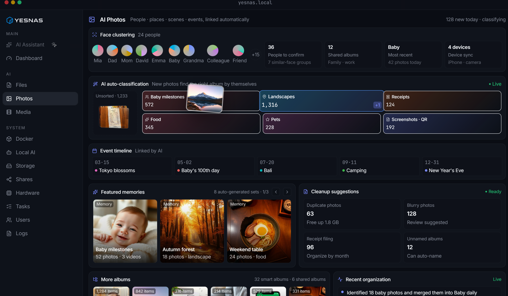
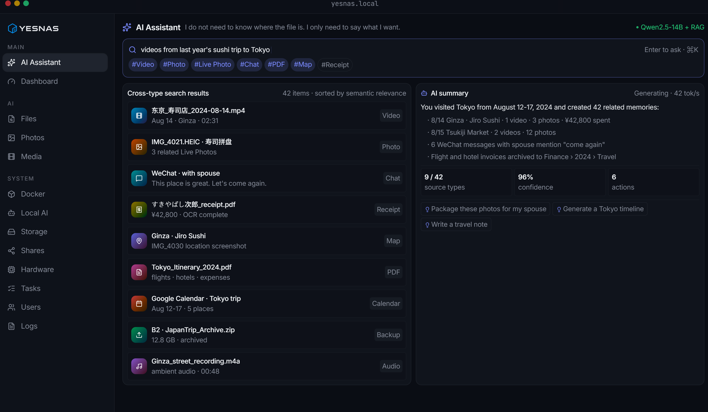
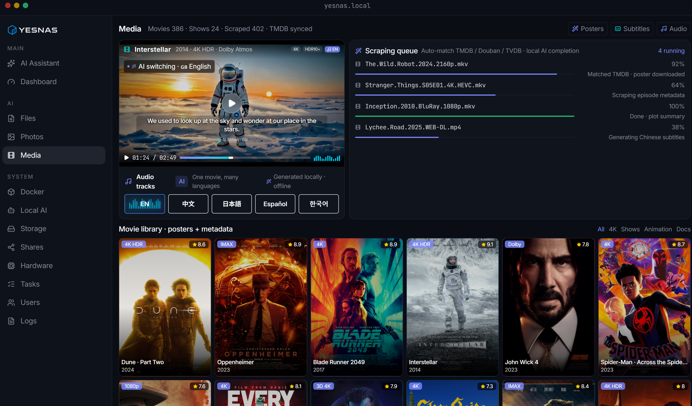
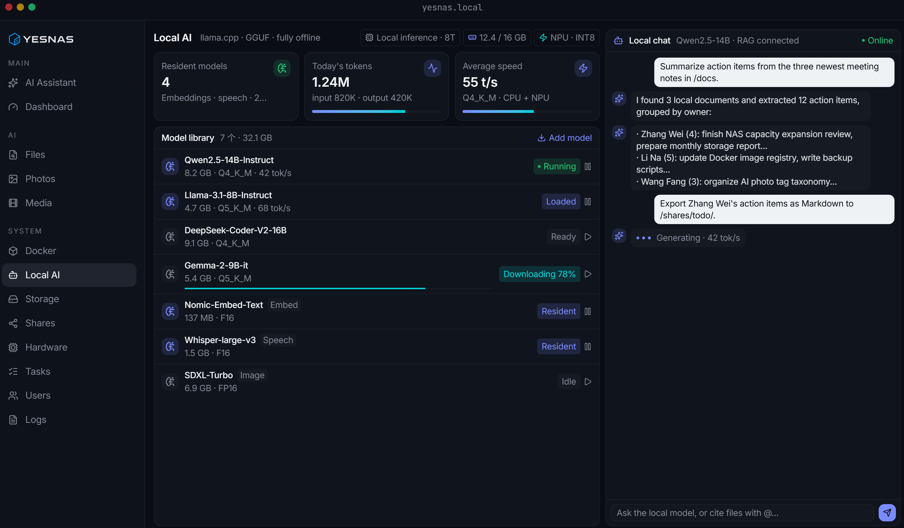
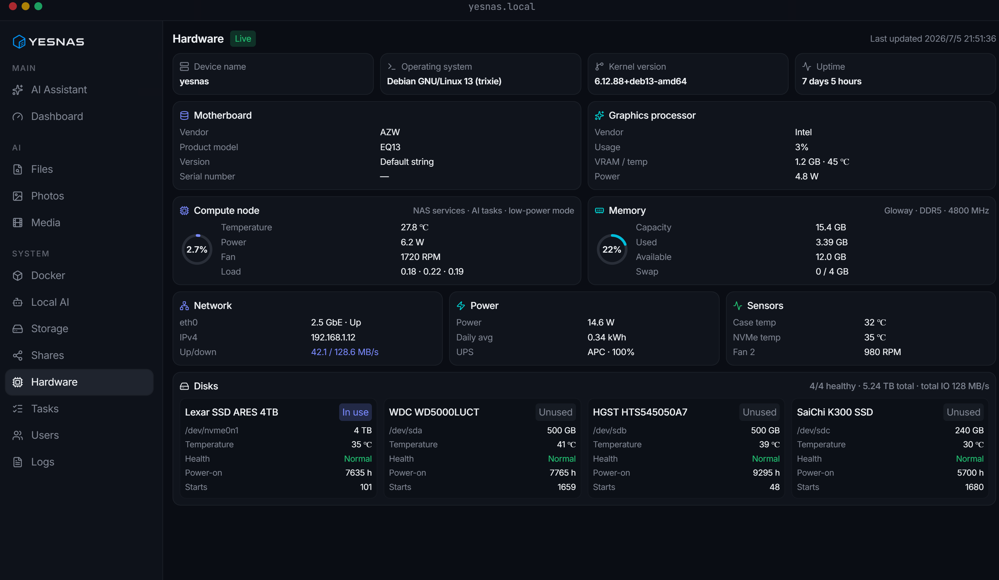

<div align="center">
  

  # YesNAS Web

  **A private AI NAS frontend system for individuals, families, and teams**

  Manage storage, files, shares, tasks, users, logs, and local AI from your own device.

  [Website](https://www.yesnas.com) · [Backend](https://github.com/i-dj/yesnas-server) · [Report an Issue](https://github.com/i-dj/yesnas-web/issues)
</div>

---

## Overview

YesNAS Web is the frontend management system for YesNAS. Designed with a local-first approach, it brings everyday NAS management together with AI-powered file understanding, semantic search, smart photo organization, and media enhancement in one unified workspace.

This repository currently includes frontend modules for authentication, system overview, file management, storage pools, file sharing, Docker, hardware information, background tasks, users, and audit logs. The system is available in Chinese, English, Japanese, and Korean.

> This repository contains the web frontend only. APIs, authentication, storage, and system services are provided by [yesnas-server](https://github.com/i-dj/yesnas-server).

## Key Features

| Module | Capabilities |
| --- | --- |
| File management | Browse and upload files, manage folders, and select storage locations |
| Storage management | Monitor disks and storage pools, manage snapshots and network storage, and review capacity |
| File sharing | Configure SMB, NFS, WebDAV, and other sharing protocols from one place |
| System operations | Monitor hardware, background tasks, Docker, users, and audit logs |
| Authentication and preferences | Session authentication, persistent sign-in, themes, and saved language preferences |
| AI experiences | Dedicated workflows for semantic search, smart photos, media enhancement, and local models |

## Product Preview

### AI Photos

Automatically organize photos by people, places, scenes, and events. Create smart albums, timelines, and featured memories while identifying duplicate or blurry photos for cleanup.



### Cross-Type AI Search

Search videos, photos, conversations, PDFs, map locations, and backups with natural language. Related content can be summarized and turned into suggested follow-up actions.



### AI Media Center

Manage posters, metadata, subtitles, and audio tracks in one place. Local AI can enrich media metadata, generate subtitles, and process multilingual audio tracks.



### Local AI Models

Manage local inference, embedding, speech, and image models directly on the NAS. Review resource usage, inference speed, downloads, and runtime status.



### Hardware Monitoring

Monitor the operating system, motherboard, processor, graphics, memory, network, power, sensors, and disk health from a unified dashboard.



## Technology Stack

- [Next.js 16](https://nextjs.org/) with App Router
- [React 19](https://react.dev/) and TypeScript
- [Tailwind CSS 4](https://tailwindcss.com/)
- [next-intl](https://next-intl.dev/) for internationalization
- [Radix UI](https://www.radix-ui.com/) primitives
- [Zustand](https://zustand.docs.pmnd.rs/) for state management
- Framer Motion, Chart.js, and Recharts
- Uppy and TUS for file uploads

## Getting Started

### Requirements

- Node.js 20.9 or later
- pnpm
- An accessible YesNAS backend service

### Installation

```bash
git clone https://github.com/i-dj/yesnas-web.git
cd yesnas-web

pnpm install
pnpm dev
```

After the development server starts, open [http://localhost:3000](http://localhost:3000).

The frontend sends API, SSE, and TUS upload requests to the same-origin `/api/v1` path. Configure your reverse proxy to forward `/api/*` to the YesNAS backend service.


### Available Scripts

```bash
# Start the development server
pnpm dev

# Create a production build
pnpm build

# Start the production server
pnpm start
```

## Project Structure

```text
yesnas/
├─ app/                 # Next.js pages, layouts, and routes
│  ├─ (admin)/          # Authenticated administration pages
│  └─ (auth)/           # Sign-in and password recovery pages
├─ components/          # Layout and reusable UI components
├─ docs/images/         # Product screenshots used in this README
├─ hooks/               # React hooks
├─ i18n/                # Internationalization configuration and messages
├─ lib/                 # APIs, dates, authentication, and service utilities
├─ public/              # Static assets
├─ store/               # Zustand stores
└─ types/               # TypeScript type definitions
```

## Internationalization

The frontend system currently supports:

- Simplified Chinese (`zh`)
- English (`en`)
- Japanese (`ja`)
- Korean (`ko`)

The selected language is stored in a browser cookie and remains consistent between the sign-in page and the authenticated management system. When no preference has been saved, YesNAS uses the browser language when supported and falls back to English otherwise.

## Related Links

- Website: [yesnas.com](https://www.yesnas.com)
- Web frontend: [i-dj/yesnas-web](https://github.com/i-dj/yesnas-web)
- Backend service: [i-dj/yesnas-server](https://github.com/i-dj/yesnas-server)

## License

Licensing information will be provided in a future `LICENSE` file.
